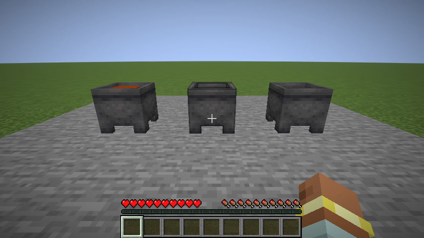

# Alchemical Leather

What if **dyeable armor** could carry your potions?

A **Fabric mod for Minecraft 26.2** that turns familiar armor into alchemical equipment. Pour a potion into a cauldron, infuse a compatible piece, equip it, and take the effect with you.

## Start experimenting

Try a **Speed potion, an empty cauldron and unenchanted leather leggings**. Pour the potion, use the leggings on the cauldron, then equip them.

Once that works:

- Put the armor away for a while, then return to it.
- Try a different kind of potion bottle.
- Try armor that is dyeable but is not ordinary player leather armor.
- Add dye to a water cauldron and see what compatible armor does with it.

Humanoid armor still cares about which effect belongs on which body part, while animal/BODY armor follows a different potion rule. **Infusions and enchantments are mutually exclusive.** Use **Crouch + Use** to pour splash or lingering potions without throwing them. Water cauldrons wash compatible armor clean.

Want the answers rather than the experiment? The **[player guide](docs/GUIDE.md)** explains armor eligibility, BODY armor, duration rules, dyed water and compatibility. It contains spoilers.

## Install

Requires **Minecraft 26.2, Java 25, Fabric Loader 0.19.5+ and Fabric API 0.159.0+26.2 or newer for 26.2**.

Download a regular JAR from [releases](https://github.com/R3Neer/alchemical-leather/releases) and put it in `mods`. Install the mod and Fabric API on **both client and server**. No optional content mod is required.

This is an **alpha**. Back up worlds before updating and check [validation and remaining manual checks](docs/validation.md); tested integrations are not a blanket modpack guarantee.

## Go further

- [Player guide / wiki](docs/GUIDE.md) — complete mechanics, with spoilers.
- [Datapack support](docs/GUIDE.md#datapack-support) — effect slots and custom dyeable-armor fallback.
- [Build and tests](docs/GUIDE.md#building) · [Architecture](docs/architecture.md) · [Issues](https://github.com/R3Neer/alchemical-leather/issues)

[GPL-3.0-or-later](LICENSE). Not an official Minecraft product; not approved by or associated with Mojang or Microsoft.
