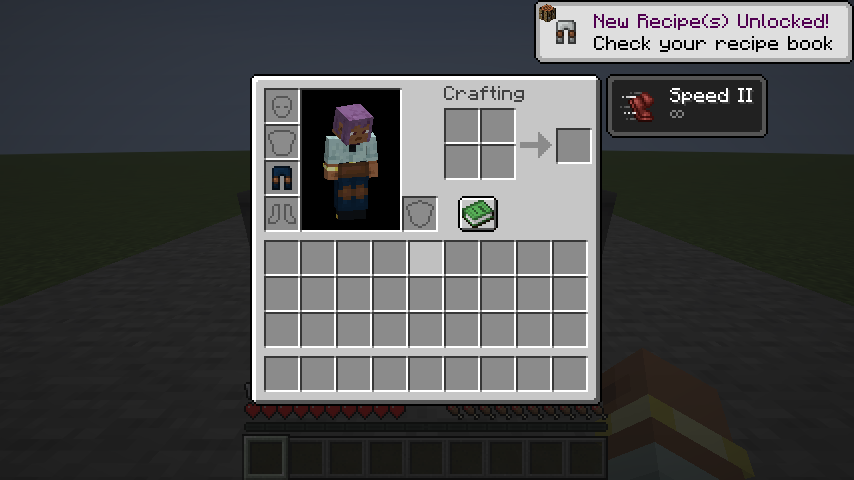

# Alchemical Leather — player guide

[← Back to README](../README.md)

This is the detailed reference, including mechanics and configuration that the
README intentionally leaves for discovery. Information below is retained from
the public branch; it does not describe unrelated unpublished local changes.

## Contents

- [How it works](#how-it-works)
- [Effects and armor slots](#effects-and-armor-slots)
- [Installation](#installation)
- [Mod compatibility](#mod-compatibility)
- [Datapack support](#datapack-support)
- [Building](#building)
- [License](#license)

---

## Original overview

Alchemical Leather is a Fabric mod that lets leather armor absorb potion effects. Each piece can hold one effect, turning a basic set of leather armor into a flexible set of alchemical equipment.

[](https://www.minecraft.net/)
[](https://fabricmc.net/)
[](../LICENSE)


## How it works

1. Pour a potion into a normal cauldron. It can hold up to three identical bottles.
2. Use an unenchanted piece of leather armor on the potion-filled cauldron. One dose is consumed and the armor takes on the potion's color.
3. Equip the armor to receive its effect.
4. Wash the armor in a water cauldron when you want to remove the infusion and its color.

Splash and lingering potions are poured with **sneak + right-click**, which prevents them from being thrown accidentally.

Only one effect can be stored on each piece. Infusing it again replaces the previous effect instead of combining levels or durations. Potions with multiple effects, such as Turtle Master, cannot be used.

### Potion types

| Potion | Infusion behavior |
|---|---|
| Normal | Keeps its original level and duration. Time passes only while the armor is equipped. |
| Splash | Behaves like a normal potion after being poured into the cauldron. |
| Lingering | Provides its effect indefinitely while equipped. |
| Instant effect | Activates once when the armor is equipped, then the infusion is consumed. |



Infused armor cannot be enchanted, and enchanted armor cannot be infused. Armor trims, custom names, durability and other item data are preserved. Renaming and repairing with leather work normally.

## Effects and armor slots

| Armor piece | Effects |
|---|---|
| Leather Cap | Night Vision, Invisibility, Water Breathing, Blindness (Deeper Dark), Lava Vision (Alex's Mobs) |
| Leather Tunic | Strength, Weakness, Regeneration, Fire Resistance, Poison, Instant Health, Instant Damage, Wind Charged, Oozing, Infested, Growth, Shrinking, Poison Resistance, Bug Pheromones, Soulsteal, Reaching, Reach Boost, Scorching |
| Leather Pants | Speed, Slowness, Jump Boost, Weaving |
| Leather Boots | Slow Falling, Knockback Resistance, Clinging, Reorientation (Clinging Reoriented) |

## Installation

Alchemical Leather must be installed on both the client and server.

- Minecraft 26.2
- Fabric Loader 0.19.5 or newer
- Fabric API 0.159.0+26.2 or newer
- Java 25

Download the JAR from the [latest release](https://github.com/R3Neer/alchemical-leather/releases/latest) and place it in the instance's `mods` folder.

## Mod compatibility

Alchemical Leather works on its own. It also includes support for effects and mechanics from these tested versions:

- BedrockIfy 1.11.8
- Scale Brews 0.1.0-beta.3 and beta.4
- Alex's Mobs Continued 2.1.9
- Clinging Reoriented 0.1.0-alpha.4
- Friends&Foes 4.0.27
- Wilder Wild 4.2.11
- Deeper Dark 4.4.1
- Additional Additions 10.0.12
- Enchancement 26.2-r4
- Functional Armor Trims 2.2.1
- Grind Enchantments 4.2.1+26.1.2

BedrockIfy potion cauldrons can be picked up by Alchemical Leather when they contain complete bottle doses. Dyed water from BedrockIfy can also recolor infused armor without removing its effect.

With Clinging Reoriented 0.1.0-alpha.4 or newer, Reorientation potions can be infused into leather boots. Brew one by adding a shulker shell to a Clinging potion. Clinging permits one gravity change per airborne stretch, restored on landing; Reorientation permits unlimited changes. Normal, splash and lingering infusions follow the duration rules above. This integration is optional.

## Datapack support

The armor slot for an effect is controlled by datapack files. A rule goes in:

```text
data/<effect_namespace>/alchemical_leather/effect_slots/<effect_path>.json
```

```json
{
  "slot": "chestplate"
}
```

Valid values are `helmet`, `chestplate`, `leggings` and `boots`. Rules may also use `enabled`, `requires_mod`, `requires_resource` and `requires_effect` for overrides and optional content. `requires_effect` takes a registered effect ID; the rule stays inactive if that effect is absent, including when an older optional mod version is installed.

## Building

Use Java 25 and the included Gradle wrapper:

```powershell
.\gradlew.bat build
```

Additional test tasks:

```powershell
.\gradlew.bat runGameTest
.\gradlew.bat runClientGameTest
```

The standalone suite contains 28 project GameTests, plus Fabric's environment check. Compatibility fixtures have also been run with both supported Scale Brews betas and the optional mods listed above. See [the validation report](validation.md) for the complete results and remaining manual checks.

## License

Alchemical Leather is available under the [GNU General Public License v3.0 or later](../LICENSE).
